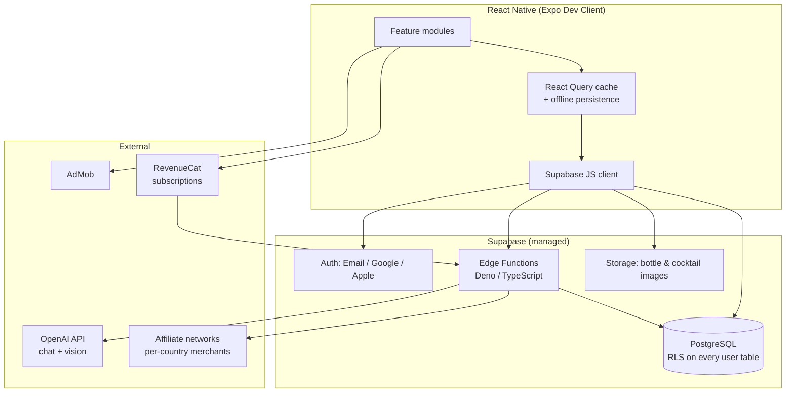

# MixAI — System Architecture (v1)

> Status: **Adopted** · Owner: CTO · Last updated: 2026-07-24
>
> This document is the source of truth for MixAI's technical architecture. Every
> milestone implementation must conform to it. Changes go through a PR that
> updates this file first.

---

## 1. Product context

MixAI is an AI-powered cocktail assistant. The core loop:

1. User tells us what bottles they own (manual now, camera later).
2. We tell them what they can make, what they *almost* can make, and what to buy.
3. An AI bartender converses with full knowledge of their inventory and taste.

Revenue: affiliate commerce ("buy Cointreau, unlock 54 cocktails"), ads, and a
premium subscription. The architecture below is designed so all three exist as
**server-side decisions**, never client-side hardcoding.

---

## 2. High-level architecture



**The rule that keeps this scalable:** the client talks to PostgreSQL directly
(through RLS) only for *simple CRUD on the user's own data* — inventory,
favorites, profile. Everything with business logic — recommendations, AI chat,
affiliate resolution, entitlements — goes through **Edge Functions**. This
keeps monetization logic, prompt engineering, and merchant selection
server-side where we can change them without an app-store release.

---

## 3. Stack decisions and tradeoffs

### 3.1 Expo — but with Dev Client, not Expo Go

Google Sign-In, Apple Sign-In, AdMob, and RevenueCat all require native
modules. Expo Go cannot load them. We therefore use **Expo with a custom dev
client (EAS Build)** from day one. Tradeoff: slightly slower first setup, but
we never hit the "eject wall" mid-project, and EAS gives us OTA updates
(critical for tuning prompts/UX weekly without store review).

### 3.2 Supabase — accepted, with two guardrails

Supabase (Postgres + RLS + Auth + Edge Functions) is the right MVP backend:
it deletes an entire backend team's worth of work. Two guardrails so it stays
right at scale:

1. **No business logic in the client.** RLS is an authorization layer, not an
   application layer. Anything conditional (premium checks, ad decisions,
   merchant choice, recommendation ranking) lives in Edge Functions or SQL
   functions — both replaceable later by a dedicated service without touching
   the app.
2. **The database schema is provider-neutral.** Plain PostgreSQL, migrations
   in-repo (`supabase/migrations`), no Supabase-only SQL extensions in core
   tables. If we ever outgrow Supabase, we take the database with us.

### 3.3 AI provider — behind an interface

The brief says OpenAI. Fine for launch, but the AI layer is our fastest-moving
dependency, so all model calls go through a single server-side module:

```
supabase/functions/_shared/ai/
  provider.ts        // AIProvider interface: chat(), vision(), embed()
  openai.ts          // implementation
```

The client never calls an AI API and never sees an API key. It calls
`POST /functions/v1/chat`. This also lets us: route free users to cheaper
models and premium users to better ones ("Priority AI"), enforce quotas, and
swap providers per capability (e.g., a different vision model for bottle
recognition in Phase 2) with zero client changes.

### 3.4 Recommendations — SQL first, ML later

"Which cocktails can I make?" and "which single bottle unlocks the most
cocktails?" are **set-cover queries, not machine learning**. A normalized
schema (see `docs/DATA_MODEL.md`) answers both in one indexed query over
`cocktail_ingredients × user inventory`, fast enough for millions of users
because the cocktail catalog is small (thousands of rows) and per-user
inventory is tiny (tens of rows). Taste-based personalization (Phase 3) adds a
scoring layer on top — pgvector embeddings of cocktails + user taste profile —
without changing the core query. We do **not** build a recommender service now.

### 3.5 Subscriptions — RevenueCat, not hand-rolled StoreKit

Apple/Google receipt validation, grace periods, family sharing, and refunds
are a swamp. RevenueCat handles it and webhooks entitlement changes into our
database (`entitlements` table). All server-side code checks entitlements from
**our database**, never from the client — a jailbroken client can lie, our
Postgres row cannot.

### 3.6 Ads — abstracted, and honestly assessed

`AdService` interface in the client (`features/ads/`), AdMob as the first
implementation, decisions server-driven: the client asks
`GET /functions/v1/ad-policy` and gets back *whether and where* to show ads
based on entitlement, session context, and remote config. Ads never render on
the cocktail preparation screen (product rule, enforced in the policy
endpoint, not in scattered client ifs).

**CTO warning, on the record:** an alcohol-adjacent app gets a 17+/18 rating,
which shrinks AdMob fill rates and eCPM, and alcohol content limits which ad
categories can serve. Ads will likely be our *worst* revenue stream per user.
Affiliate + premium should lead; ads are the fallback monetization for
never-pay users. We build the abstraction in M6, not sooner.

### 3.7 Affiliate — a link-resolution service, not links

The client renders opaque product references. Resolution is one endpoint:

```
POST /functions/v1/resolve-offer
{ product_id, country }
→ { merchant, display_price, currency, url, tracking_params }
```

Merchant selection per country lives in the `affiliate_merchants` +
`affiliate_offers` tables (see data model). Adding a new network (Awin,
Amazon, Partnerize…) is a new resolver strategy + rows in a table — zero
client changes, zero app review. Every resolution is logged
(`affiliate_clicks`) because attribution data *is* the business.

---

## 4. Client architecture

Feature-based Clean Architecture, strict TypeScript, one direction of
dependencies: `ui → hooks (application) → services (domain) → api (infra)`.

```
app/                        # Expo Router routes (thin — routing only)
src/
  features/
    auth/
    inventory/
    cocktails/
    recommendations/
    chat/
    party/                  # Phase: later
    ads/
    subscription/
    profile/
    settings/
      # each feature:
      components/           # feature-private UI
      hooks/                # React Query hooks = application layer
      services/             # pure domain logic, no React imports
      api/                  # Supabase/Edge Function calls
      types.ts
      index.ts              # public surface; features import ONLY from here
  shared/
    ui/                     # design system: Button, Card, GlassPanel, …
    theme/                  # tokens: color, spacing, typography, motion
    lib/                    # supabase client, query client, logger, analytics
    utils/
  test/
supabase/
  migrations/               # SQL migrations, in-repo, reviewed like code
  functions/                # Edge Functions
    _shared/                # ai provider, auth guard, entitlements, zod schemas
    chat/
    recommendations/
    resolve-offer/
    ad-policy/
docs/
```

Key rules:

- **State:** React Query owns all server state (with persistence for offline
  read access to inventory + cocktail catalog). Local UI state stays in
  components; a small Zustand store only for genuinely global client state
  (theme, session). No Redux.
- **Design system first:** screens compose `shared/ui` primitives. The
  glassmorphism/dark-luxury look is implemented once in tokens + primitives,
  never per-screen.
- **Validation at every boundary:** Zod schemas shared between Edge Functions
  and client for every request/response.
- **Errors & logging:** a single `AppError` taxonomy; Sentry on client and
  Edge Functions from M1 (not "later").
- **Testing:** domain services and Edge Functions get unit tests (Vitest);
  critical flows (auth, inventory CRUD, can-make query) get integration tests
  against a local Supabase; UI gets component tests where logic warrants it.

---

## 5. Security & privacy

- RLS on every user-owned table; deny-by-default policies.
- AI keys, affiliate credentials: Edge Function secrets only.
- Rate limiting + per-user quotas on chat/vision endpoints (free tier caps).
- Age gate at onboarding (legal requirement in most target markets).
- GDPR from day one (EU is a launch market): data export + delete-account
  Edge Function, no PII in analytics events.

## 6. Performance & offline

- Cocktail catalog is public, versioned, and cached aggressively on device —
  browsing and "can I make this" work offline against the last-synced catalog
  and local inventory.
- Images: Supabase Storage behind CDN transforms; blurhash placeholders.
- The can-make computation also ships as a client-side pure function over the
  cached catalog, so the home dashboard renders instantly offline; the server
  remains authoritative for ranked/personalized lists.

## 7. What we are deliberately NOT building yet

| Not now | Why | When |
|---|---|---|
| Microservices / own backend | Supabase covers MVP scale; premature ops cost | If/when Edge Functions become the bottleneck |
| ML recommender | SQL answers the core questions exactly | Phase 3, as a ranking layer |
| Barcode/vision scanning | Manual search must be great first | Phase 2 |
| Web app | Mobile-first product | Post-PMF |
| Ads integration | Worst ROI of the three revenue streams | M6 |
