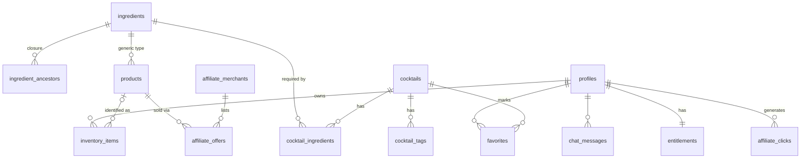

# MixAI — Data Model (v1)

> Status: **Adopted** · Companion to `ARCHITECTURE.md`.
> Implemented as SQL migrations in `supabase/migrations/` starting at M1.

The single most important design decision in this product is the
**ingredient taxonomy**. Everything else — can-make matching, "one bottle
away", affiliate upsells, AI grounding — sits on top of it.

---

## 1. The core insight: ingredients are a hierarchy

A recipe says "2 oz **bourbon**". A user owns "Maker's Mark". A different
recipe says "whiskey". A naive flat ingredient table cannot connect these
three facts, and matching quality is the product.

So ingredients form a tree:

```
spirit
└── whiskey
    ├── bourbon        ← recipe references this level
    │   └── (brands: Maker's Mark, Buffalo Trace …)
    └── rye
```

- **Recipes reference generic ingredients** (`bourbon`, `sweet vermouth`,
  `lime juice`).
- **User bottles reference a product/brand**, which points at its generic
  ingredient.
- **Matching walks the tree upward**: a bottle satisfies a recipe line if the
  bottle's ingredient is the required ingredient *or any descendant of it*.

We store the tree with a materialized **closure table**
(`ingredient_ancestors`) maintained by trigger, so matching is a plain indexed
join — no recursive CTE at query time, which is what keeps this fast at
millions of users.

## 2. Entity overview



## 3. Tables

### Catalog (public, read-only to clients, versioned)

```sql
-- Generic ingredient taxonomy. THE moat table.
create table ingredients (
  id            uuid primary key default gen_random_uuid(),
  slug          text not null unique,          -- 'bourbon'
  name          text not null,
  parent_id     uuid references ingredients(id),
  kind          text not null check (kind in
                  ('spirit','liqueur','wine','beer','mixer','juice',
                   'syrup','bitters','garnish','other')),
  abv_typical   numeric(4,1),
  is_alcoholic  boolean not null,
  created_at    timestamptz not null default now()
);

-- Closure table: one row per (ancestor, descendant) pair incl. self.
-- Maintained by trigger on ingredients. Makes matching a flat join.
create table ingredient_ancestors (
  ancestor_id   uuid not null references ingredients(id),
  descendant_id uuid not null references ingredients(id),
  depth         smallint not null,
  primary key (ancestor_id, descendant_id)
);

-- Purchasable, brandable products (a bottle SKU). Affiliate target.
create table products (
  id            uuid primary key default gen_random_uuid(),
  ingredient_id uuid not null references ingredients(id),
  brand         text not null,
  name          text not null,                 -- 'Maker's Mark 46'
  volume_ml     int,
  abv           numeric(4,1),
  barcode       text,                          -- EAN/UPC, Phase 2 scanning
  image_path    text,
  created_at    timestamptz not null default now()
);
create index on products (ingredient_id);
create unique index on products (barcode) where barcode is not null;

create table cocktails (
  id            uuid primary key default gen_random_uuid(),
  slug          text not null unique,
  name          text not null,
  description   text not null,
  history       text,
  difficulty    text not null check (difficulty in ('easy','medium','hard')),
  method        text not null,                 -- preparation steps (markdown)
  glass         text not null,
  garnish       text,
  abv_estimate  numeric(4,1),
  calories      int,                           -- nullable until sourced
  image_path    text,
  search        tsvector generated always as
                  (to_tsvector('simple', name || ' ' || description)) stored,
  created_at    timestamptz not null default now()
);
create index on cocktails using gin (search);

create table cocktail_ingredients (
  cocktail_id   uuid not null references cocktails(id) on delete cascade,
  ingredient_id uuid not null references ingredients(id),
  amount        numeric(6,2),
  unit          text,                          -- 'ml','oz','dash','piece'
  is_optional   boolean not null default false,
  is_garnish    boolean not null default false,
  note          text,
  primary key (cocktail_id, ingredient_id)
);
create index on cocktail_ingredients (ingredient_id);

create table cocktail_tags (
  cocktail_id uuid not null references cocktails(id) on delete cascade,
  tag         text not null,                   -- 'refreshing','sour','tiki',
  primary key (cocktail_id, tag)               -- 'summer','party','low-abv'
);
create index on cocktail_tags (tag);
```

### User data (RLS: owner-only, deny by default)

```sql
create table profiles (
  id           uuid primary key references auth.users(id) on delete cascade,
  display_name text,
  country      char(2),                        -- drives affiliate merchant pick
  birth_date   date,                           -- age gate
  taste        jsonb not null default '{}',    -- Phase 3 taste profile
  created_at   timestamptz not null default now()
);

create table inventory_items (
  id           uuid primary key default gen_random_uuid(),
  user_id      uuid not null references profiles(id) on delete cascade,
  -- Either a known product, or a bare generic ingredient ("some gin"):
  product_id   uuid references products(id),
  ingredient_id uuid not null references ingredients(id),
  volume_ml    int,
  remaining_pct smallint check (remaining_pct between 0 and 100),
  purchased_at date,
  is_favorite  boolean not null default false,
  image_path   text,                           -- user's own bottle photo
  created_at   timestamptz not null default now()
);
create index on inventory_items (user_id);

create table favorites (
  user_id     uuid not null references profiles(id) on delete cascade,
  cocktail_id uuid not null references cocktails(id) on delete cascade,
  created_at  timestamptz not null default now(),
  primary key (user_id, cocktail_id)
);

create table chat_messages (
  id          uuid primary key default gen_random_uuid(),
  user_id     uuid not null references profiles(id) on delete cascade,
  role        text not null check (role in ('user','assistant')),
  content     text not null,
  created_at  timestamptz not null default now()
);
create index on chat_messages (user_id, created_at desc);

-- Written ONLY by RevenueCat webhook (service role). Read by server code.
create table entitlements (
  user_id     uuid primary key references profiles(id) on delete cascade,
  tier        text not null default 'free' check (tier in ('free','premium')),
  expires_at  timestamptz,
  updated_at  timestamptz not null default now()
);
```

### Monetization (server-only; clients never read these directly)

```sql
create table affiliate_merchants (
  id          uuid primary key default gen_random_uuid(),
  name        text not null,                   -- 'Amazon DE', 'Drankdozijn'
  network     text not null,                   -- 'amazon','awin','custom'
  countries   char(2)[] not null,              -- ['NL','BE']
  priority    int not null default 100,        -- lower wins on ties
  config      jsonb not null default '{}',     -- tag ids, deeplink templates
  is_active   boolean not null default true
);

create table affiliate_offers (
  id           uuid primary key default gen_random_uuid(),
  product_id   uuid not null references products(id),
  merchant_id  uuid not null references affiliate_merchants(id),
  country      char(2) not null,
  url_template text not null,                  -- resolver fills tracking params
  price_cents  int,
  currency     char(3),
  updated_at   timestamptz not null default now(),
  unique (product_id, merchant_id, country)
);
create index on affiliate_offers (product_id, country);

create table affiliate_clicks (
  id          uuid primary key default gen_random_uuid(),
  user_id     uuid references profiles(id) on delete set null,
  offer_id    uuid not null references affiliate_offers(id),
  context     text not null,                   -- 'unlock_upsell','chat','detail'
  created_at  timestamptz not null default now()
);
```

## 4. The two queries that ARE the product

**Can-make + missing-one, in one pass** (SQL function
`get_makeable_cocktails(user_id)`), conceptually:

```sql
with owned as (              -- every generic ingredient the user satisfies,
  select distinct ia.ancestor_id as ingredient_id
  from inventory_items ii    -- via the closure table (Maker's Mark ⇒ bourbon
  join ingredient_ancestors ia on ia.descendant_id = ii.ingredient_id
  where ii.user_id = $1      --  ⇒ whiskey ⇒ spirit)
),
gaps as (
  select ci.cocktail_id,
         count(*) filter (where o.ingredient_id is null
                          and not ci.is_optional
                          and not ci.is_garnish) as missing
  from cocktail_ingredients ci
  left join owned o on o.ingredient_id = ci.ingredient_id
  group by ci.cocktail_id
)
select cocktail_id, missing from gaps where missing <= 1;
```

`missing = 0` → "you can make these". `missing = 1` → "one bottle away", which
feeds directly into the affiliate upsell:

**Best next bottle** (`get_unlock_counts(user_id)`): group the `missing = 1`
rows by the absent ingredient, count cocktails unlocked per ingredient, join
to `products`/`affiliate_offers` for the user's country. That is the
"buy Cointreau → unlock 54 cocktails" feature — one query, no ML.

Both run over a catalog of a few thousand cocktails × ≤ ~15 ingredients each;
with the indexes above this is single-digit milliseconds and trivially
cacheable per (user, inventory-version).

## 5. Phase hooks already accounted for

- **Phase 2 vision:** `products.barcode` + `inventory_items.image_path`
  exist; scan flow only *writes* to existing tables.
- **Phase 3 taste:** `profiles.taste` jsonb + a future
  `cocktail_embeddings` pgvector table rank the *existing* result set — the
  matching layer never changes.
- **Party mode:** pure Edge Function composition over these tables; no new
  core entities beyond a `party_plans` user table.
- **Seed data:** we build our own catalog (public-domain IBA recipes +
  original descriptions). We do NOT scrape licensed databases — licensing on
  cocktail *descriptions/photos* is real; recipes themselves are facts and not
  copyrightable, prose is.
